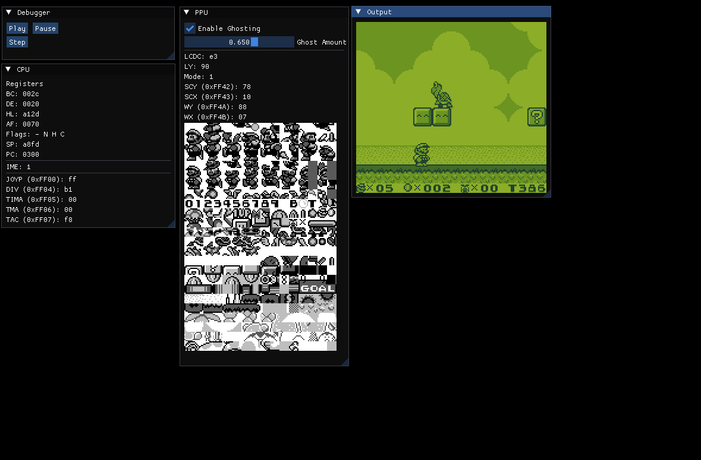

# gbEX 

gbEX is an emulator, currently, for the original DMG Gameboy. The whole emulator exists in `Source/GBEX`, it was made to be embedded in other applications as an emulator, due to this the emulator was built with only C++17 and made with
memory safety in mind. 

The emulator has been tested with a few mooneye gb tests and blargg tests for compliance and passes most but fails some on accuracy, mostly within the timer. 



## Features

- CPU, PPU and Timer implementations. 
- Exposed Joypad API to funnel external events to the internal emulator registers. 
- MBC1, MBC5 fully implemented -> No saving as of yet. 
- Mostly accurate DMG LCD emulation. Including the ability to control ghosting and the DMG display colours. 

## TODO

- Proper APU implementation.
- Gameboy Color emulation. 
- Rest of the MBCs 
- Proper emulator App to use to demonstrate the emulator. 
- Move the gbEX code into a library.
- More accurate emulation. 

## Building

The Project uses git submodules and CMake.

```
git clone --recursive https://github.com/Progalt/gbex.git
```
To clone the repository and its submodules. You can then run CMake to build the project. 